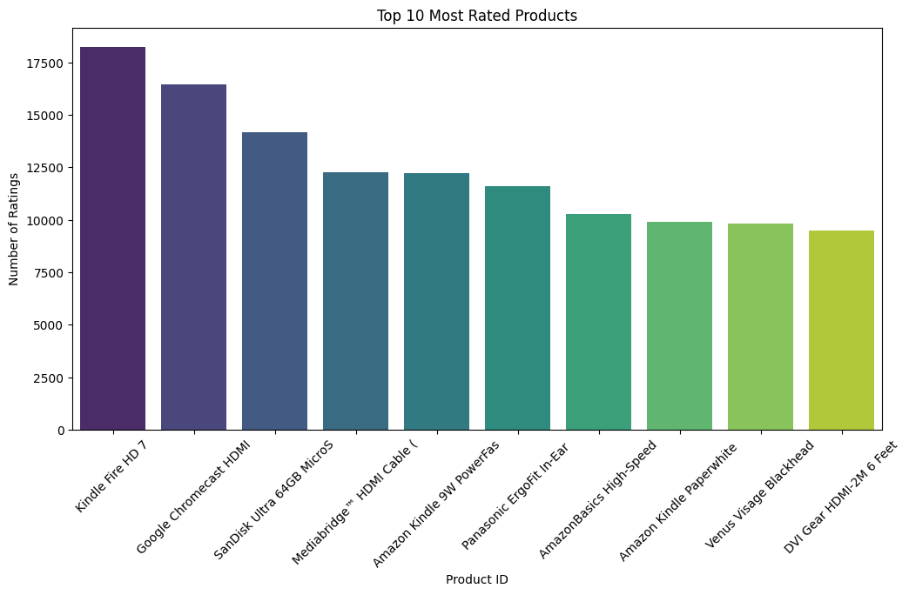
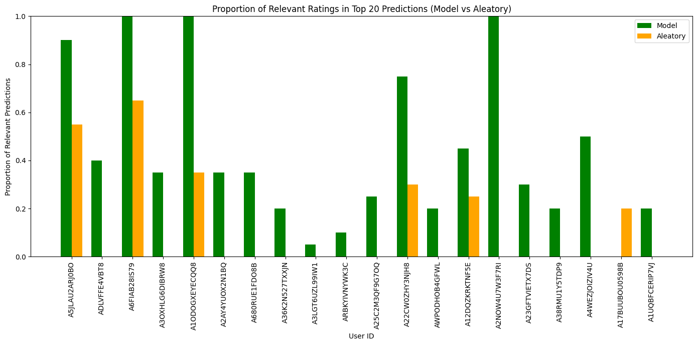

# E-commerce Product Recommendation System

## Table of Contents

1. [Introduction and Objectives](#introduction-and-objectives)
2. [Technologies Used](#technologies-used)
3. [Installation](#installation)
4. [Loading Configuration and Dataset](#loading-configuration-and-dataset)
5. [Exploratory Data Analysis](#exploratory-data-analysis)
   - [Data Overview](#data-overview)
   - [Checking for Missing Values](#checking-for-missing-values)
   - [Checking for Duplicates](#checking-for-duplicates)
   - [Analysis and Distribution of Ratings](#analysis-and-distribution-of-ratings)
   - [Correlation Between Number of Ratings and Average Rating](#correlation-between-number-of-ratings-and-average-rating)
   - [Distribution of Average Ratings per User](#distribution-of-average-ratings-per-user)
   - [Analysis of Products with the Most Variety in Ratings](#analysis-of-products-with-the-most-variety-in-ratings)
   - [Analysis of Popular vs. Less Popular Products](#analysis-of-popular-vs-less-popular-products)
6. [Collaborative Filtering with Surprise](#collaborative-filtering-with-surprise)
   - [Data Preprocessing](#data-preprocessing)
   - [Singular Value Decomposition (SVD)](#singular-value-decomposition-svd)
   - [Non-Negative Matrix Factorization (NMF)](#non-negative-matrix-factorization-nmf)
   - [BaselineOnly](#baselineonly)
   - [CoClustering](#coclustering)
   - [K-Nearest Neighbors](#k-nearest-neighbors)
7. [Model Performance Evaluation](#model-performance-evaluation)
8. [Results](#results)
9. [Custom Metric and Evaluation](#custom-metric-and-evaluation)
10. [Conclusion](#conclusion)
11. [Future Work](#future-work)
12. [License](#license)
13. [Contact](#contact)

---

## Introduction and Objectives

This project focuses on building a **product recommendation system** for an e-commerce platform using the **Amazon Product Review Dataset**. The goal is to recommend products to users based on their past interactions (ratings and browsing history) to enhance user engagement and increase sales.

### Objectives

- **Personalized product recommendations** for users.
- **Improve user engagement** on the platform.
- **Increase sales** through relevant product suggestions.

## Technologies Used

- **PostgreSQL** for data storage and SQL-based data manipulation.
- **Surprise Library** for collaborative filtering models, including SVD, KNN, and NMF.
- **Python** for data analysis and model implementation.
- **Pandas, NumPy** for data manipulation and analysis.
- **Matplotlib, Seaborn** for data visualization.

## Installation

### Prerequisites

- **Python 3.8+**
- **PostgreSQL**
- **Required Python libraries**:
  - pandas
  - numpy
  - scikit-learn
  - sqlalchemy
  - surprise
  - matplotlib
  - seaborn
  - requests
  - beautifulsoup4

### Steps to Install

1. **Clone the repository**:

   
bash
   git clone git@github.com:Tomrun974/amazon-product-recommender.git
   cd amazon-product-recommender

2. **Create a virtual environment**:

   
bash
   python3 -m venv env
   source env/bin/activate

3. **Install dependencies**:

   
bash
   pip install -r requirements.txt

4. **Set up the PostgreSQL database**:

   - Make sure PostgreSQL is installed and running.
   - Create a database named amazon_reviews and import the dataset into a table called reviews.

## Loading Configuration and Dataset

In this section, we load the necessary libraries and import the dataset from the PostgreSQL database. Ensure the configuration matches your environment, such as database credentials.

## Exploratory Data Analysis

We perform several steps to analyze the dataset, including checking for missing values, duplicates, and analyzing the distribution of ratings.

### Data Overview
   - Overview of the dataset structure, including types and basic statistics.

### Checking for Missing Values
   - Ensure no missing values are present in the dataset.

### Checking for Duplicates
   - Identify and remove duplicate entries if necessary.

### Analysis and Distribution of Ratings
   - Analyze the distribution of product ratings given by users.
   - We also analyzed the most rated products, identifying the top 10 products with the highest number of reviews.

### Correlation Between Number of Ratings and Average Rating
   - Explore the correlation between the number of ratings an item receives and its average rating.

### Distribution of Average Ratings per User
   - Analyze how the average rating per user is distributed.

### Analysis of Products with the Most Variety in Ratings
   - Identify products that have the highest variance in their received ratings.

### Analysis of Popular vs. Less Popular Products
   - Compare average ratings between popular and less popular products.

## Collaborative Filtering with Surprise

We use the **Surprise** library to implement collaborative filtering models. Various techniques such as **SVD**, **NMF**, and **KNN** are employed to predict user ratings for unseen items.

### Data Preprocessing
   - Preprocessing the data for use in the Surprise library and splitting it into training and test sets.

### Singular Value Decomposition (SVD)
   - Applying SVD for matrix factorization to generate recommendations.

### Non-Negative Matrix Factorization (NMF)
   - Using NMF to factorize the interaction matrix with non-negative constraints.

### BaselineOnly
   - A simple model that computes the baseline estimate for ratings.

### CoClustering
   - Clustering both users and items to estimate ratings based on co-clusters.

### K-Nearest Neighbors
   - Using KNN variants (e.g., KNNBasic, KNNWithMeans) to recommend products based on user-item similarity.

## Model Performance Evaluation

We evaluate the performance of all models using metrics such as **RMSE** (Root Mean Square Error) and **MAE** (Mean Absolute Error). Lower values indicate better performance.

## Results

- **Best Model**: The **SVD** model achieved an RMSE of **1.27**, indicating its superior performance compared to other models.

### Model Comparison:

| Model           | RMSE  | MAE   |
|-----------------|-------|-------|
| SVD             | 1.27  | 1.00  |
| NMF             | 1.36  | 1.05  |
| BaselineOnly    | 1.27  | 1.00  |
| CoClustering    | 1.37  | 1.06  |
| KNNBasic        | 1.35  | 1.06  |

## Custom Metric and Evaluation

In addition to traditional metrics like RMSE and MAE, a **custom relevance-based metric** was developed to evaluate the model's performance. The goal of this metric was to assess the **relevance of the top-N recommendations** provided by the model for users with the most interactions in the dataset.

---

### Approach

- We calculated a **relevance threshold** for each user, based on their median rating, to identify recommendations likely to be deemed relevant by the user.
- We evaluated the proportion of relevant recommendations in the **top-N predictions** for users who had rated the most items in the dataset.
- Additionally, a comparison was made with random recommendations to demonstrate the effectiveness of the model.
- The relevance threshold was adjusted using a **relevance factor of 0.8**, which raises the bar to focus on recommendations closer to the user’s highest ratings. This ensures that only the most relevant items, highly aligned with user preferences, are counted as "relevant" recommendations.

### Results

The custom metric demonstrated the model's superiority over random predictions. For example, the model achieved a much higher **proportion of relevant recommendations** for most users compared to random recommendations.

- For some users with a significant number of ratings, the model provided up to **20 out of 20 relevant recommendations**, while random predictions achieved significantly fewer relevant suggestions.
- With a **relevance factor of 0.8**, the model delivers **5 times more relevant recommendations** (52%) compared to random predictions (9%), showing that it effectively focuses on items that are more likely to satisfy the user’s tastes.

This result highlights that the **recommendation model consistently generates more relevant recommendations** for users, aligning closely with their preferences and providing a better user experience.

---

## Conclusion

This project successfully implemented a recommendation system using collaborative filtering techniques. The **SVD model** performed the best, achieving a satisfactory RMSE. In addition, the custom relevance-based metric demonstrated that the model's recommendations are not only accurate but also highly relevant to users.

## Future Work

- **Content-based filtering**: Combine collaborative filtering with product features to improve recommendations.
- **Hyperparameter Optimization**: Use advanced techniques for optimizing model parameters.
- **Additional Metrics**: Evaluate models using precision, recall, and F1-score.
- **Production Deployment**: Deploy the recommendation system for real-time user testing.

## Contact

For any inquiries or suggestions, feel free to contact:

- **Name**: Thomas THIERRY
- **Email**: thomas.thierry@epita.fr

---

© 2024 Thomas THIERRY. All rights reserved.
